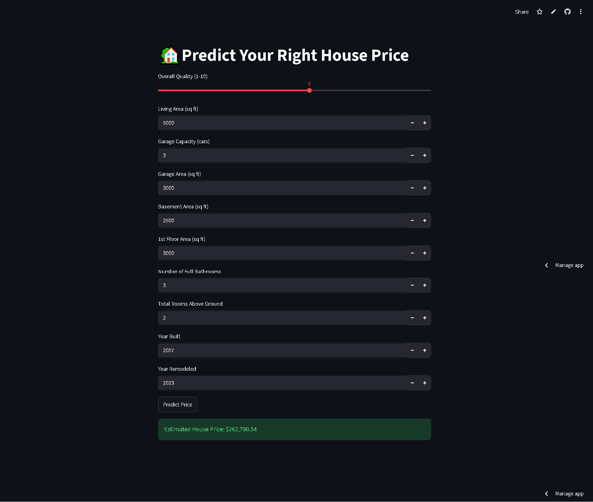

# 🏡 House Price Prediction System

A Machine Learning web application that predicts house prices based on key property features. Built using Python, Scikit-Learn, Random Forest Regressor, and Streamlit.

# Screenshots 


## 🚀 Live Demo

https://techyh.streamlit.app/

## 📌 Project Overview

This project predicts the estimated price of a house using important features such as:

- Overall Quality
- Living Area
- Garage Capacity
- Garage Area
- Basement Area
- 1st Floor Area
- Number of Bathrooms
- Total Rooms
- Year Built
- Year Remodeled

The model was trained on the Ames Housing Dataset and deployed using Streamlit Cloud.

Initially, I considered using Linear Regression as a baseline model because it is simple and interpretable. However, real-world house price data is rarely perfectly linear and often contains complex relationships between features.

So I chose Random Forest Regressor

---

## 🛠️ Technologies Used

- Python
- Pandas
- Scikit-Learn
- Random Forest Regressor
- StandardScaler
- Streamlit
- Joblib
- Git & GitHub

---

## 📊 Machine Learning Workflow

### 1. Data Collection
- Ames Housing Dataset

### 2. Data Cleaning
- Missing value analysis
- Feature selection
- Removal of highly missing columns

### 3. Exploratory Data Analysis (EDA)
- Correlation analysis
- Feature importance investigation
- Dataset understanding

### 4. Feature Engineering
Selected the most relevant features:

- OverallQual
- GrLivArea
- GarageCars
- GarageArea
- TotalBsmtSF
- 1stFlrSF
- FullBath
- TotRmsAbvGrd
- YearBuilt
- YearRemodAdd

### 5. Model Training
Models tested:

- Linear Regression
- Random Forest Regressor

Final model selected:

✅ Random Forest Regressor

### 6. Model Evaluation

Model Performance:

- Training R² Score: ~0.91
- Test R² Score: ~0.88

This indicates good predictive performance with controlled overfitting.

### 7. Deployment

- Model saved using Joblib
- Web interface built using Streamlit
- Deployed on Streamlit Cloud

---

## 📂 Project Structure

```text
house_price_prediction/
│
├── app.py
├── train_model.py
├── house_price_model_rf.pkl
├── house_price_scaler.pkl
├── requirements.txt
├── README.md
│
├── data/
│   └── train.csv

```

## 💻 Installation

Clone the repository:

```bash
git clone https://github.com/TechyGautam/HousePricePrediction_App.git
```

Move into the project folder:

```bash
cd HousePricePrediction_App
```

Install dependencies:

```bash
pip install -r requirements.txt
```

Run the application:

```bash
streamlit run app.py
```
Or 
```bash
py -m streamlit run app.py
```

---

## 🎯 Key Learnings

Through this project I learned:

- Data Cleaning
- Missing Value Handling
- EDA Techniques
- Correlation Analysis
- Feature Selection
- Model Evaluation
- Overfitting Detection
- Model Serialization using Joblib
- Streamlit Deployment
- GitHub Project Management

---

## 📈 Future Improvements

- Hyperparameter Tuning
- More Feature Engineering
- XGBoost Implementation
- Advanced Visualizations
- Improved UI/UX
- Model Explainability

---

## 👨‍💻 Author

**Tanishk Gautam**

B.Tech CSE (AI/ML)

Passionate about Machine Learning, AI, and Building Real-World Projects.

GitHub: https://github.com/TechyGautam

LinkedIn: www.linkedin.com/in/tanishk-gautam-a70075383